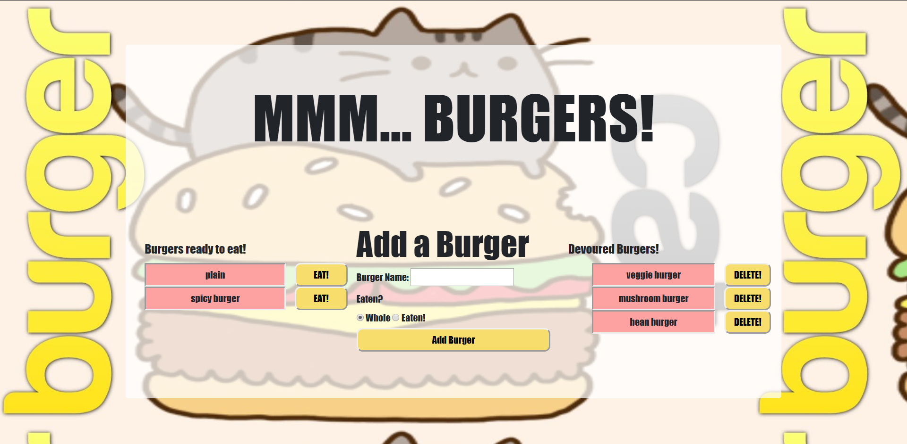

# Dats Da Burger

## Deployed Link
https://dats-da-burger.herokuapp.com/

## Discription
This application is a burger counter using MySQL, Heroku, JawsDB, Node, Express, Handlebars and a homemade ORM

## Use
Open the link above and add to my burgers! Then you can track all of your burger eating but it would be combined with all of my burger eating and we may get confused... Maybe we should deploy sepparate instances so we can both count our own burgers and not get confused. If you would like to do this follow the steps below.

## Deployment

### Requirements 
  - Github account
  - mySQL workbench
  - Heroku account
  - JawsDB Heroku add-on

### Directions
  - Clone this repository:
    - Open Command Line Interface (CLI) and navigate to the folder you want to clone this repository into.
    - CLI Command: "git clone git@github.com:ajrsabet/Thats_Da_Burger.git"
    - CLI Command: "npm install"
  
  Localhost setup:
  - MODIFY FILE ./config/connection.js on line 13 if your mySQL workbench password is not "password"
  - mySQL local database setup:
   - Copy/paste content of db/schema.sql into mySQL workbench and run then  
   - Optional: Copy/paste content of ./db/seeds.sql into mySQL workbench if you want sample burgers to be populated 
  - CLI Command: "node server.js"
  - In browser go to: http://localhost:8080
  
  Heroku deployment:
  - Create a new Heroku app by following the directions at: https://devcenter.heroku.com/articles/creating-apps
  - Open your new Heroku app by loging into your account or, if you setup the project through your CLI, by following the link provided (example: https://git.heroku.com/example.git)
  - Click on "Configure Add-ons" and search for "JawsDB MySQL"
  - Setup JawsDB by following the documentation at: https://devcenter.heroku.com/articles/jawsdb
  - Files to modify:
    - ADD a file named ".env" at the root level
      - COPY your jawsDB URL into that file set to the variable
        - JAWSDB_URL = "mysql://(your link here found on the JawsDB project page)"
  - Create a new database in MySQL to connect to JawsDB
    - In MySQL navigate to the home page by clicking on the home icon in the top left of the workbench
    - Click the wrench icon to the right of "MySQL Connections" heading
    - Use the JawsDB connection settings on this page, no other setting should need to be changed from default if they are not listed here. (below: "MySQL Setting" = "JawsDB Setting")
      - "Connection Name" = "Database"
      - "Hostname" = "Host"
      - "Port" = "Port"
      - "Username" = "Username"
      - "Password" click "Store in Vault..." = "Password"
  - Push your changes to Github
  - CLI comand: "git push heroku master"
  - Open your Heroku deployed link
  - Start counting your burgers from any device from anywhere in the world! How neat is that!!!
  If you think that this burger tracker is neat then you would also love this: https://www.youtube.com/watch?v=Hm3JodBR-vs

